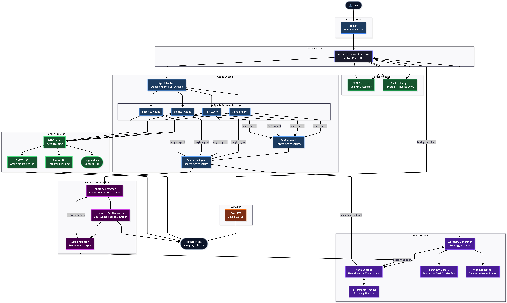

# AutoArchitect — Self-Learning Multi-Agent Neural Architecture Search

AutoArchitect is an AI-powered system that automatically designs, trains, and deploys neural networks from plain English problem descriptions. It combines Differentiable Architecture Search (DARTS NAS) with a multi-agent pipeline and a self-learning brain that improves with every problem it solves.

> **Oakland Research Showcase 2026**

---

## Components



## Full Architecture


---

## What It Does

You describe a problem in plain English. AutoArchitect handles everything else:

1. Classifies the problem domain using BERT (image / text / medical / security)
2. Fetches the best matching dataset from HuggingFace automatically
3. Runs DARTS Neural Architecture Search to discover the optimal network structure
4. Trains the model using ResNet18 transfer learning (vision) or NAS (text/security)
5. Fuses results from multiple specialized agents when needed
6. Self-evaluates its own output and feeds the score back to improve future decisions
7. Packages and delivers the trained agent network as a deployable ZIP

---

## How It Works

```
Your Problem (plain English)
        ↓
BERT Classifier → domain (image / text / medical / security)
        ↓
Cache Check → instant result if seen before
        ↓
Brain → picks best strategy from past experience
        ↓
Web Researcher → finds best dataset automatically
        ↓
Specialist Agents → run NAS + self-training
        ↓
FusionAgent → merges multi-agent results
        ↓
SelfEvaluator → scores output, feeds back to Brain
        ↓
Trained Model + Deployable ZIP
```

---

## Self-Learning Feedback Loops

AutoArchitect improves with every problem it solves through 4 feedback loops — no human intervention needed:

| Loop | What Happens |
|---|---|
| **Brain Learning** | Training accuracy feeds back into the Meta-Learner for smarter future decisions |
| **Self-Evaluation** | Brain scores its own generated ZIP and updates the Topology Designer |
| **Cache Reinforcement** | Reused solutions reinforce the strategies that produced them |
| **Topology Learning** | Network quality scores improve topology selection over time |

---

## Example Problems

| You type... | AutoArchitect builds... |
|---|---|
| `detect potholes in road images` | ResNet18 image classifier trained on road data |
| `classify spam emails` | DARTS NAS text classifier |
| `detect fraud in transactions` | Security agent with anomaly detection |
| `identify skin diseases from photos` | Medical ResNet18 with transfer learning |
| `write a summary of this article` | Routes to Llama 3 — no training needed |

---

## Models Used

| Model | Role |
|---|---|
| **BERT** (`bert-base-uncased`) | Problem domain classification |
| **ResNet18** | Transfer learning for image + medical problems |
| **DARTS NAS** (custom DARTSNet) | Architecture search for text + security problems |
| **YOLOv5** | Real-time object detection |
| **Llama 3.1-8B** via Groq | Text generation fallback |

---

## Tech Stack

- **PyTorch** — DARTS NAS, ResNet18 transfer learning
- **Transformers / BERT** — problem domain classification
- **HuggingFace Datasets** — free dataset discovery and loading
- **Groq API (Llama 3.1)** — LLM for text generation tasks
- **YOLOv5** — real-time object detection
- **Flask** — REST API server
- **scikit-learn** — meta-learner utilities

---

## Project Structure

```
autoarchitect/
├── app.py                        # Flask server — all routes
├── api/
│   ├── orchestrator.py           # Main controller
│   ├── nas_engine.py             # DARTS NAS implementation
│   ├── analyzer.py               # BERT problem classifier
│   ├── self_trainer.py           # Auto self-training pipeline
│   ├── transfer_trainer.py       # ResNet18 transfer learning
│   ├── auto_trainer.py           # Base model selection + YOLO
│   ├── cache_manager.py          # Problem → result cache
│   ├── dataset_fetcher.py        # HuggingFace dataset loading
│   ├── agents/
│   │   ├── image_agent.py        # Vision domain agent
│   │   ├── text_agent.py         # NLP domain agent
│   │   ├── medical_agent.py      # Medical imaging agent
│   │   ├── security_agent.py     # Security/fraud agent
│   │   ├── fusion_agent.py       # Merges multi-agent results
│   │   ├── evaluator_agent.py    # Scores architecture quality
│   │   └── agent_factory.py      # Creates agents on demand
│   └── brain/
│       ├── workflow_generator.py # Generates optimal workflows
│       ├── meta_learner.py       # Learns from every solved problem
│       ├── topology_designer.py  # Designs agent network topologies
│       ├── self_evaluator.py     # Scores brain's own output
│       ├── web_researcher.py     # Finds best model/dataset online
│       └── network_zip_generator.py # Generates deployable ZIPs
├── brain_data/                   # Persisted brain state (JSON)
├── datasets/                     # Downloaded + cached datasets
├── models/                       # Trained model weights (.pth)
├── docs/
│   └── architecture/             # Architecture diagrams
├── static/                       # Frontend CSS + JS
└── templates/index.html          # Single-page UI
```

---

## API Endpoints

| Endpoint | Method | Description |
|---|---|---|
| `/` | GET | Web UI |
| `/api/analyze` | POST | Classify problem domain with BERT |
| `/api/search` | POST | Run NAS search (with cache) |
| `/api/orchestrate` | POST | Full pipeline — problem → trained model |
| `/api/self-train` | POST | Trigger self-training on a problem |
| `/api/train` | POST | Train with auto-selected base model |
| `/api/detect` | POST | YOLO object detection on an image |
| `/api/predict` | POST | Inference on a trained NAS model |
| `/api/predict-user` | POST | Inference on a user-trained model |
| `/api/upload-data` | POST | Upload labeled data and train a custom model |
| `/api/download/multi-nas` | POST | Download full NAS package as ZIP |
| `/api/download/network` | POST | Download generated agent network as ZIP |
| `/api/topology/preview` | POST | Preview agent topology for a problem |
| `/api/brain/status` | GET | Brain learning stats |
| `/api/brain/eval-stats` | GET | Self-evaluator statistics |
| `/api/cache/stats` | GET | Cache statistics |

---

## Setup

### Prerequisites

- Python 3.9+
- pip
- A free Groq API key — [console.groq.com](https://console.groq.com)

### 1. Clone the repository

```bash
git clone https://github.com/your-username/autoarchitect.git
cd autoarchitect
```

### 2. Install dependencies

```bash
pip install torch torchvision flask flask-cors transformers datasets \
            huggingface-hub requests python-dotenv Pillow scikit-learn
```

### 3. Configure environment

```bash
cp .env.template .env
# Edit .env — add your GROQ_API_KEY
```

### 4. Run the server

```bash
cd autoarchitect
python app.py
# Open http://localhost:5000
```

### 5. Run NAS from the CLI

```bash
python run_nas.py --problem "detect potholes in road images"
python run_nas.py --problem "classify spam messages" --epochs 5
```

---

## Environment Variables

| Variable | Required | Description |
|---|---|---|
| `GROQ_API_KEY` | Optional | Enables LLM text generation. Free at [console.groq.com](https://console.groq.com) |

---

## Persistent Data

| Directory | Contents |
|---|---|
| `brain_data/` | Strategies, meta-learner examples, topology history |
| `datasets/hf_cache/` | HuggingFace downloaded datasets |
| `models/trained/` | Trained model weights + class label files |
| `user_data/` | User-uploaded labeled datasets per problem |
| `cache/` | Problem → architecture/accuracy cache entries |

---

## License

MIT License — see [LICENSE](LICENSE) for details.
